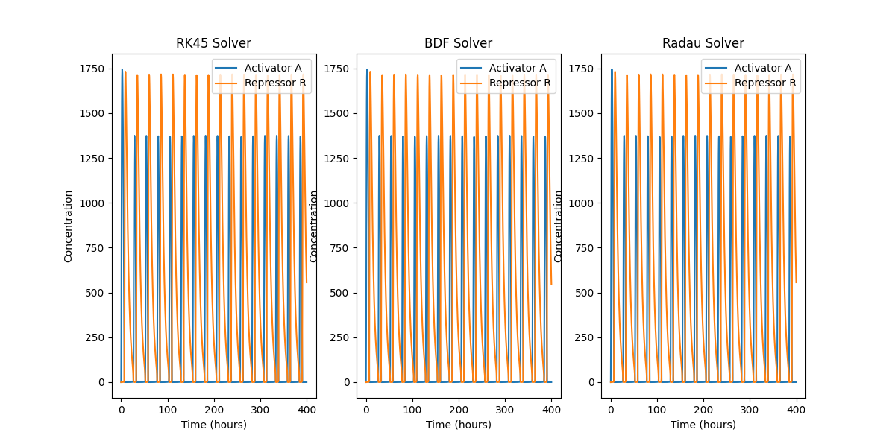
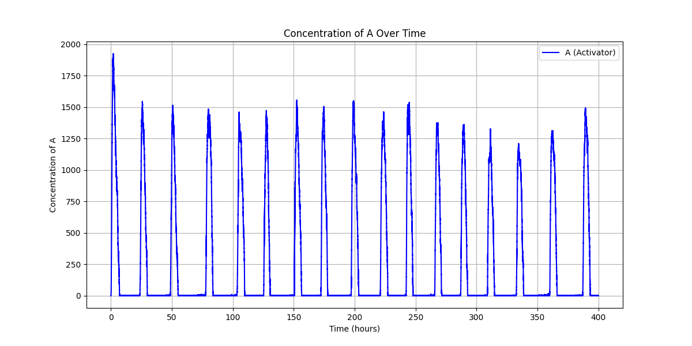
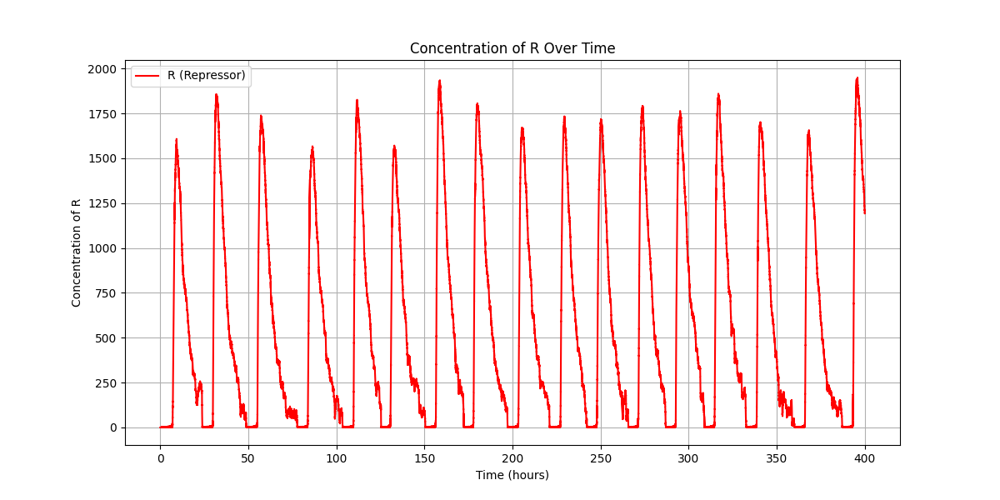
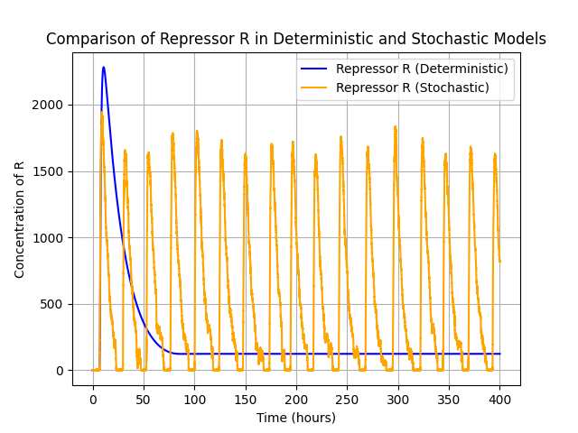

# 🧬 Genetic Oscillator Simulation

This repository contains Python code for simulating a genetic oscillator, based on a simplified model of activator and repressor proteins. The project implements both deterministic and stochastic models of genetic oscillators, exploring the dynamics of circadian rhythms and noise resistance mechanisms in genetic networks.

---

## 📌 Project Overview

Genetic oscillators are fundamental in many biological processes, such as circadian rhythms. This project explores how different models can represent the behavior of activator (A) and repressor (R) proteins over time. Two modeling approaches are used:

### 🧮 Deterministic Model (ODE-based)
A system of ordinary differential equations (ODEs) is solved using various integration methods:
- RK45
- BDF
- Radau  
to simulate the behavior of the system under ideal, noise-free conditions.

### 🎲 Stochastic Model (SSA-based)
The Stochastic Simulation Algorithm (SSA) is used to simulate randomness in biochemical reactions, modeling real-world noise and its effects on protein concentration dynamics.

---

## ✨ Features

- Simulates a genetic oscillator with activator and repressor proteins
- Implements both deterministic (ODE) and stochastic (SSA) models
- Compares different ODE solvers
- Visualizes protein concentration over time
- Explores effects of noise on oscillatory behavior

---

## 💻 Requirements

- Python 3.x  
- NumPy  
- SciPy  
- Matplotlib
- 
---

## 🚀 How to Run the Code

1. **Clone the Repository:**

```bash
git clone https://github.com/yourusername/genetic-oscillator-simulation.git
cd genetic-oscillator-simulation
```

2. **Run the Main Script:**

```bash
python main.py
```

This will generate plots showing the concentrations of activator (A) and repressor (R) proteins over time using both deterministic and stochastic simulations.

---
# 🧪 Results

This section presents the results of simulating the genetic oscillator using both deterministic (ODE-based) and stochastic (SSA-based) approaches. Each figure highlights different dynamic aspects of the activator (A) and repressor (R) protein concentrations.

## 📈 1. Comparison of ODE Solvers

The deterministic simulation is run using three different ODE solvers: RK45, BDF, and Radau. Below is the comparison of how these solvers predict the oscillatory behavior of the activator (A) and repressor (R) proteins:



Each solver captures similar oscillatory dynamics with varying stiffness-handling capabilities and computational efficiency.

## 🔄 2. Stochastic Simulation of Activator and Repressor

The stochastic simulation uses the Stochastic Simulation Algorithm (SSA) to model intrinsic noise. Here we plot the time evolution of activator (A) and repressor (R) molecules over time.

**Activator A Concentration:**



**Repressor R Concentration:**



This clearly shows that stochastic effects lead to fluctuations in concentrations, which are not observed in the deterministic simulations.

## ⚙️ 3. Impact of Parameter Change: Lower Repressor Degradation (δ<sub>R</sub> = 0.05)

To explore system sensitivity to degradation rates, the repressor degradation rate δ<sub>R</sub> was lowered from 0.2 to 0.05.

**Deterministic Simulation:**

.png)

**Stochastic Simulation:**

.png)

## 🆚 4. Combined View: Deterministic vs Stochastic

To compare the effects of noise, we overlay the deterministic and stochastic results for the Repressor R:



This plot emphasizes how intrinsic fluctuations can significantly influence system behavior, potentially masking or distorting rhythmic patterns observed in deterministic models.


---

Feel free to fork, modify, and experiment with different parameters to explore genetic circuit dynamics!
